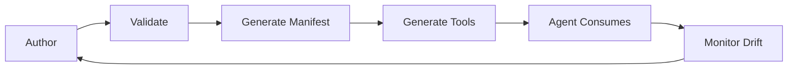

# Semantic Contract

A semantic contract is a formal, machine-readable declaration of what an interface interaction means, what it requires, and what it guarantees. AXAG annotations express semantic contracts.

## Contract vs Description

A **description** tells you about something. A **contract** binds you to something.

When AXAG declares `axag-preconditions='["cart_validated"]'`, this is not informational — it is contractual. It means:
- The operation MUST NOT be invoked unless `cart_validated` is true
- The manifest MUST include this precondition
- The tool definition MUST surface this constraint
- The agent runtime MUST validate this before execution

## Contract Components

Every AXAG semantic contract consists of:

1. **Identity** — Intent and entity declarations
2. **Interface** — Parameters, types, and constraints
3. **Preconditions** — Required state before execution
4. **Postconditions** — Guaranteed state after execution
5. **Safety** — Risk level, confirmation, approval requirements
6. **Execution semantics** — Action type, idempotency, side effects

## Contract Lifecycle

Contracts are authored by frontend engineers, validated by CI, transformed into manifests and tools, consumed by agents, and monitored for drift.

## Next Steps

- [Intent vs Presentation](/docs/concepts/intent-vs-presentation)
- [Specification Overview](/docs/specification/overview)
