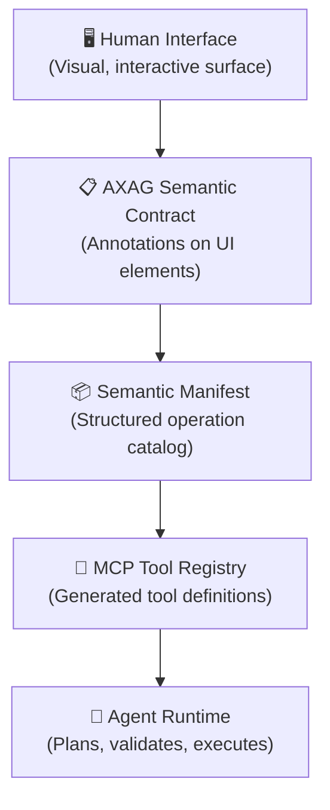

import NormativeCallout from '@site/src/components/NormativeCallout';

# Mental Model: How AXAG Works

Before writing your first annotation, understand the mental model that makes AXAG work.

## The Two Audiences

Every interface element serves two audiences simultaneously:

1. **Human users** — who perceive the element visually and interact manually
2. **AI agents** — who need to discover, understand, and invoke the element programmatically

Traditional interfaces serve only the first audience. AXAG adds a semantic layer that serves the second.

## The Five-Layer Architecture



### Layer 1: Human Interface
The existing UI. No changes required to visual design, layout, or user interaction patterns.

### Layer 2: AXAG Semantic Contract
Annotations added to UI elements. These annotations declare intent, entity, action type, parameters, constraints, preconditions, risk level, and safety requirements.

### Layer 3: Semantic Manifest
A JSON document generated from annotations. It catalogs every operation available on a page, section, or application with full parameter schemas and safety metadata.

### Layer 4: MCP Tool Registry
Tool definitions generated from the manifest following the Model Context Protocol specification. Each operation becomes a callable tool with typed inputs and safety constraints.

### Layer 5: Agent Runtime
The agent reads the tool registry, plans which tools to invoke, validates parameters against constraints, and executes operations.

## The Key Insight

<NormativeCallout level="MUST">
Agents MUST interact with systems through semantic operations declared in the AXAG contract — not through scraping, prompt interpretation, or visual inference.
</NormativeCallout>

This means:
- The agent does **not** parse the DOM to find buttons
- The agent does **not** read button text to guess intent
- The agent does **not** inspect CSS classes to identify elements
- The agent **reads** the Semantic Manifest to discover operations
- The agent **reads** tool definitions to understand invocation contracts
- The agent **validates** parameters against declared constraints before execution

## From UI Element to Agent Action

Here is the complete transformation path for a single UI element:

### Step 1: The UI Element (Human-Facing)
```html title="Before — plain HTML button"
<button onclick="handleCheckout()">Proceed to Checkout</button>
```

### Step 2: Add AXAG Annotations
```html title="After — AXAG-annotated checkout button" showLineNumbers
<button
  axag-intent="checkout.begin"
  axag-entity="order"
  axag-action-type="mutate"
  axag-required-parameters='["cart_id","payment_method_id","shipping_address_id"]'
  <!-- axag-highlight-start -->
  axag-preconditions='["cart_validated","inventory_reserved"]'
  axag-postconditions='["checkout_session_created"]'
  axag-risk-level="high"
  axag-confirmation-required="true"
  <!-- axag-highlight-end -->
  axag-scope="customer"
  onclick="handleCheckout()"
>
  Proceed to Checkout
</button>
```

### Step 3: Generate Semantic Manifest Entry
```json title="axag-manifest.json — checkout entry" showLineNumbers
{
  "intent": "checkout.begin",
  "entity": "order",
  "operation": "begin_checkout",
  "parameters": {
    "cart_id": { "type": "string", "required": true },
    "payment_method_id": { "type": "string", "required": true },
    "shipping_address_id": { "type": "string", "required": true }
  },
  "preconditions": ["cart_validated", "inventory_reserved"],
  "postconditions": ["checkout_session_created"],
  "risk_level": "high",
  "scope": "customer",
  "execution_type": "mutate",
  "confirmation_required": true
}
```

### Step 4: Generate MCP Tool Definition
```json title="MCP tool definition — begin_checkout" showLineNumbers
{
  "tool_name": "begin_checkout",
  "description": "Start checkout for a validated cart and create a checkout session.",
  "input_schema": {
    "type": "object",
    "properties": {
      "cart_id": { "type": "string" },
      "payment_method_id": { "type": "string" },
      "shipping_address_id": { "type": "string" }
    },
    "required": ["cart_id", "payment_method_id", "shipping_address_id"]
  },
  "safety": {
    "execution_type": "mutate",
    "risk_level": "high",
    "confirmation_required": true
  }
}
```

### Step 5: Agent Invokes the Tool
The agent runtime:
1. Discovers `begin_checkout` in the tool registry
2. Validates that `cart_id`, `payment_method_id`, and `shipping_address_id` are provided
3. Checks that `cart_validated` and `inventory_reserved` preconditions are met
4. Notes that this is a high-risk mutating operation requiring confirmation
5. Requests user confirmation
6. Executes the operation
7. Verifies that `checkout_session_created` postcondition is satisfied

## Next Steps

- [First Annotated Action](/docs/getting-started/first-annotated-action) — Annotate your first UI element
- [First Semantic Manifest](/docs/getting-started/first-semantic-manifest) — Generate a manifest
- [First Generated Tool](/docs/getting-started/first-generated-tool) — Produce an MCP tool definition
