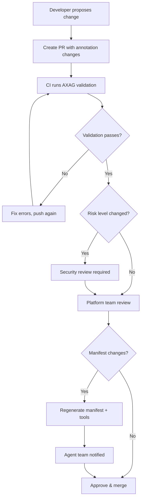

# Change Review Workflow

All changes to AXAG annotations, manifests, and generated tools follow a structured review workflow to ensure safety, consistency, and backward compatibility.

## Standard Review Flow



## Review Triggers

| Change | Reviews Required |
|--------|-----------------|
| New annotation (low risk) | Platform team |
| New annotation (high/critical risk) | Platform + Security |
| Risk level increase | Security team |
| Risk level decrease | Platform team |
| New entity type | Architecture + Platform |
| Parameter schema change | Platform + Feature |
| Safety metadata change | Security team |
| Manifest version bump | All stakeholders |

## PR Template for AXAG Changes

```markdown
## AXAG Change Request

### Change Type
- [ ] New annotation
- [ ] Modify existing annotation
- [ ] Remove annotation
- [ ] Manifest schema change
- [ ] Safety metadata change

### Affected Intents
- `entity.action_name`

### Risk Assessment
- Previous risk level: ___
- New risk level: ___
- Reason for change: ___

### Breaking Changes
- [ ] This change is backward-compatible
- [ ] This change breaks existing tool consumers (migration guide attached)

### Security Checklist
- [ ] Risk level is appropriate for the operation
- [ ] Confirmation is required for high/critical risk
- [ ] Approval roles are specified where needed
- [ ] Scope boundaries are declared
- [ ] Preconditions are machine-checkable

### Testing
- [ ] Static validation passes
- [ ] Manifest regenerated and validated
- [ ] Generated tools tested with agent framework
```

## Emergency Change Process

For urgent fixes (e.g., security vulnerability in annotations):

1. Create hotfix branch
2. Fix the annotation
3. Get Security team approval (async, within 1 hour)
4. Merge with expedited review
5. Create follow-up ticket for full review
