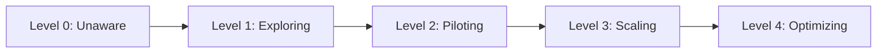

# Conformance Adoption Levels

Organizations adopt AXAG incrementally. These adoption levels provide a roadmap from initial experimentation to full production deployment.

## Adoption Maturity Model

### Level 0: Unaware
- No AXAG annotations
- Agents rely on scraping, screenshots, or custom integrations
- High maintenance, brittle, non-portable

### Level 1: Exploring
- Team awareness of AXAG
- Reading documentation, evaluating fit
- No production annotations yet
- **Goal**: Understand the value proposition

### Level 2: Piloting
- 1–3 pages annotated with AXAG attributes
- Basic conformance (Level 1: required fields only)
- Manual manifest creation
- Testing with a single agent framework
- **Goal**: Prove the concept works

### Level 3: Scaling
- Annotations on all major user flows
- Intermediate conformance (Level 2: parameters, risk, idempotency)
- Automated manifest generation in CI
- Multiple agent frameworks consuming the manifest
- Validation integrated into PR review
- **Goal**: Production-grade agent support

### Level 4: Optimizing
- Full conformance (Level 3: preconditions, safety, tenant boundaries)
- Runtime validation enforcing contracts
- Comprehensive test coverage for annotation accuracy
- Cross-domain consistency validated
- Contributing back to the standard
- **Goal**: Best-in-class agent experience

## Adoption Checklist

### Pilot Phase
- [ ] Read the Introduction and Getting Started sections
- [ ] Annotate one read-only action (e.g., search)
- [ ] Annotate one write action (e.g., create)
- [ ] Create a minimal Semantic Manifest
- [ ] Generate one MCP tool from the manifest
- [ ] Test with an agent framework

### Scaling Phase
- [ ] Annotate all customer-facing actions
- [ ] Add parameter types and constraints
- [ ] Declare risk levels for all write/delete operations
- [ ] Set up CI validation (AXAG-LINT rules)
- [ ] Generate full manifest automatically
- [ ] Register tools with agent runtime

### Optimizing Phase
- [ ] Add preconditions and postconditions
- [ ] Declare side-effects for all write operations
- [ ] Implement runtime validation
- [ ] Add tenant boundary declarations
- [ ] Achieve full conformance certification
- [ ] Contribute use cases back to AXAG community

## Measuring Progress

Track adoption with these metrics:

| Metric | Formula | Target |
|--------|---------|--------|
| Annotation Coverage | Annotated actions ÷ Total actions | > 90% |
| Conformance Score | Fields declared ÷ Fields required at level | 100% at target level |
| Manifest Freshness | Time since last manifest update | < 1 sprint |
| Validation Pass Rate | CI runs passed ÷ Total CI runs | > 95% |
| Agent Success Rate | Successful tool calls ÷ Total tool calls | > 98% |
