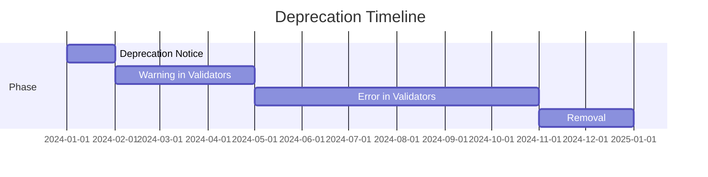

# Deprecation Strategy

When AXAG fields, intents, or patterns need to be removed, a structured deprecation process ensures consumers have time to migrate.

## Deprecation Timeline



| Phase | Duration | Action |
|-------|----------|--------|
| Notice | Day 0 | Deprecation announced in changelog, docs, and release notes |
| Warning | Months 1–3 | Validators emit deprecation warnings; code continues to work |
| Error | Months 4–9 | Validators emit errors; code still works at runtime |
| Removal | Month 12 | Field/feature removed from spec and validators |

## Deprecation Notice Format

```json
{
  "deprecated": {
    "field": "axag-side-effects",
    "since": "0.2.0",
    "removal": "1.0.0",
    "reason": "Replaced by axag-postconditions with structured side-effect declarations",
    "migration": "Move side-effects into axag-postconditions array with 'side_effect:' prefix"
  }
}
```

## Deprecation in Documentation

Deprecated features are marked in docs with:
- ⚠️ **Deprecated** banner at the top of the relevant page
- Strikethrough in reference tables
- Link to migration guide
- Replacement recommendation

## Migration Guides

Every deprecation includes a migration guide with:
1. What is changing and why
2. Before/after code examples
3. Automated migration script (where possible)
4. Timeline for removal

## How to Check for Deprecations

```bash
# Check for deprecated usage
npx axag-lint src/ --check-deprecations

# Output
⚠️ DEPRECATED: axag-side-effects at src/Cart.tsx:42
   Use axag-postconditions instead (removal in v1.0.0)
   Migration: https://axag.org/docs/governance/deprecation-strategy#migration-guides
```
