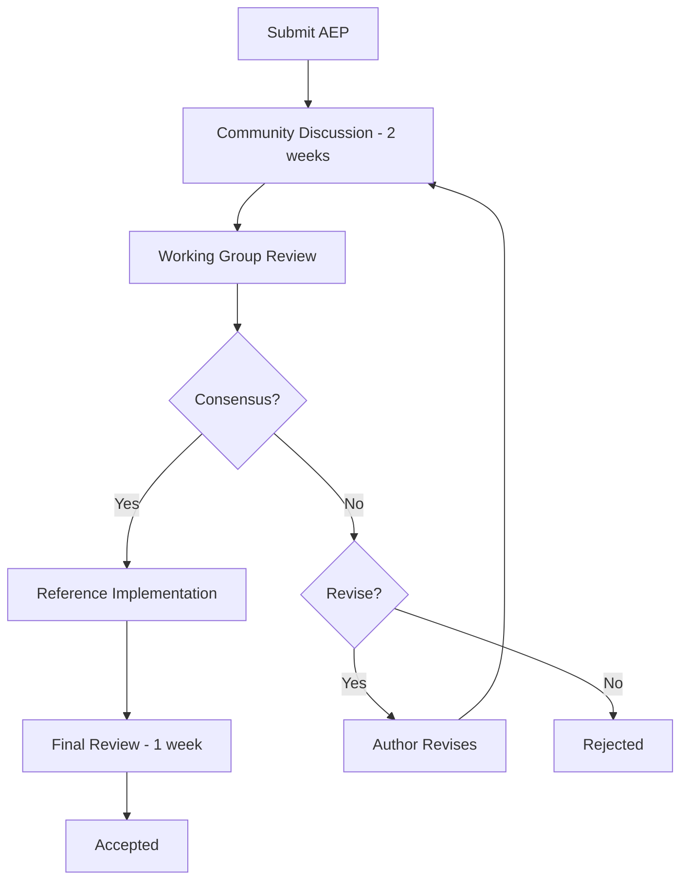

# Standard Evolution Process

The AXAG standard evolves through a structured proposal, review, and adoption process. Anyone can propose changes, but all changes go through community review.

## Proposal Process

### 1. AXAG Enhancement Proposal (AEP)

Changes to the standard are proposed as AEPs:

```markdown
# AEP-XXXX: [Title]

**Author**: [Name]
**Status**: Draft | Review | Accepted | Rejected | Withdrawn
**Created**: YYYY-MM-DD
**Target Version**: X.Y.Z

## Abstract
One-paragraph summary.

## Motivation
Why is this change needed?

## Specification
Detailed technical specification of the change.

## Backward Compatibility
Impact on existing consumers.

## Reference Implementation
Link to proof-of-concept or reference implementation.

## Alternatives Considered
Other approaches evaluated and why they were rejected.
```

### 2. Review Process



### 3. Implementation

Accepted AEPs are implemented in:
1. Schema updates (JSON Schema)
2. Validator updates (lint rules)
3. Documentation updates (this site)
4. Reference tooling updates

## Working Groups

| Group | Focus | Members |
|-------|-------|---------|
| Core Spec | Annotation vocabulary, manifest schema | Spec authors, platform engineers |
| Safety & Security | Risk levels, confirmation, approval, tenant boundaries | Security engineers, compliance |
| Tooling | Validators, generators, CI integration | DevTools engineers |
| Use Cases | Domain-specific patterns, cross-domain comparison | Domain experts, solution architects |
| Governance | Version policy, deprecation, release process | Standards body, community leads |

## Decision Making

- **Consensus-driven**: Major changes require working group consensus
- **Lazy consensus**: Minor changes accepted if no objections within 2 weeks
- **Voting**: If consensus cannot be reached, simple majority of working group members
- **Veto**: Security-critical changes can be vetoed by the Safety & Security working group
