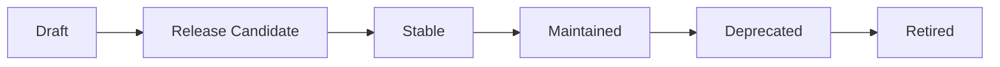

# Version Policy

The AXAG standard, Semantic Manifests, and generated tools all follow semantic versioning with clear policies for backward compatibility and migration.

## Versioning Scheme

```
MAJOR.MINOR.PATCH[-PRERELEASE]
```

- **MAJOR**: Breaking changes to required fields or fundamental semantics
- **MINOR**: New optional fields, new conformance rules, new lint rules
- **PATCH**: Documentation fixes, typo corrections, schema bug fixes
- **PRERELEASE**: Draft versions (e.g., `0.1.0-draft`)

## Current Version

The current AXAG specification version is **0.1.0-draft**.

## Version Lifecycle



| Phase | Duration | Guarantees |
|-------|----------|------------|
| Draft | Until community review complete | No stability guarantees |
| Release Candidate | 2–4 weeks | No new features, bug fixes only |
| Stable | Indefinite | Backward-compatible within major version |
| Maintained | Until next major version + 12 months | Security fixes only |
| Deprecated | 12 months from deprecation notice | No changes, migration guide available |
| Retired | After deprecation period | Removed from documentation |

## Manifest Versioning

Each Semantic Manifest includes a version field:

```json
{
  "version": "0.1.0-draft",
  "entities": ["product", "cart", "order"]
}
```

Agents MUST check the manifest version and verify they support it before consuming the manifest.

## Backward Compatibility Rules

### Within a Minor Version
- New optional fields MAY be added
- Existing fields MUST NOT be removed
- Existing field semantics MUST NOT change
- New enum values MAY be added to existing enums
- New lint rules MAY be added as warnings

### Across Major Versions
- Fields MAY be removed (with 12-month deprecation notice)
- Field semantics MAY change
- Required fields MAY be added
- Enum values MAY be removed
- Migration guide MUST be provided
