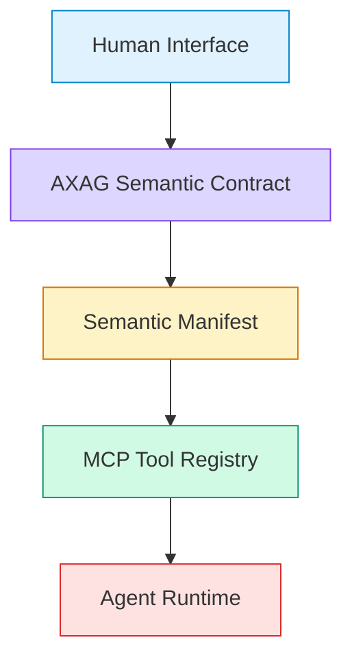

import AudienceBanner from '@site/src/components/AudienceBanner';
import NormativeCallout from '@site/src/components/NormativeCallout';
import ProposedPattern from '@site/src/components/ProposedPattern';

<AudienceBanner audiences={['All Audiences']} />

# What is AXAG?

**AXAG (Agent Experience Accessibility Guidelines)** is an annotation standard that makes interface semantics explicit and machine-readable for AI agents. It defines a **semantic interaction contract** — a formal declaration of what each interface element means, what it does, what it requires, and what it produces.

> *AX defines the discipline. AXAG defines the executable semantic contract.*

## AXAG Is Not Just Metadata

AXAG is frequently misunderstood as a metadata format — a way to add descriptive labels to UI elements. This undersells its purpose.

AXAG is a **semantic interaction contract**. It declares:

| Dimension | What It Answers |
|-----------|----------------|
| **Intent** | What is this interaction trying to accomplish? |
| **Entity** | What domain object does this interaction operate on? |
| **Action Type** | Is this a read, mutate, create, delete, or navigate operation? |
| **Parameters** | What inputs does this interaction require? |
| **Constraints** | What rules govern valid inputs? |
| **Preconditions** | What state must be true before execution? |
| **Postconditions** | What state will be true after execution? |
| **Scope** | What boundary (tenant, user, org) does this operate within? |
| **Risk Level** | How dangerous is this operation? |
| **Confirmation** | Does this require explicit confirmation? |
| **Approval** | Does this require multi-party approval? |
| **Idempotency** | Is it safe to repeat this operation? |
| **Side Effects** | What observable changes does this produce? |

This contract becomes the **source of truth** for two downstream artifacts:

1. **Semantic Manifest** — A structured document that exposes all available operations
2. **MCP Tool Registry** — Generated tool definitions that agent runtimes consume

## The Architecture



### Layer 1: Human Interface

The visual, interactive surface designed for human users. Buttons, forms, tables, navigation — everything a human sees and interacts with.

### Layer 2: AXAG Semantic Contract

The machine-readable contract that declares the **meaning, intent, constraints, and execution semantics** of interface interactions. This contract exists as annotations on UI elements.

### Layer 3: Semantic Manifest

A derived artifact generated from AXAG annotations. It exposes **discoverable, structured operations** with parameter schemas, constraint declarations, and safety metadata.

### Layer 4: MCP Tool Registry

A generated tool surface following the Model Context Protocol (MCP) specification. Agent runtimes consume this registry to discover and invoke operations **deterministically**.

### Layer 5: Agent Runtime

The planning and execution layer. It reads the tool registry, selects appropriate tools, validates constraints, and performs operations — all without scraping or visual inference.

## A Concrete Example

Consider a search button on an e-commerce product page.

### Without AXAG

```html
<button class="btn btn-primary search-btn" onclick="doSearch()">
  Search
</button>
```

An agent looking at this button knows:
- There is a button
- It says "Search"
- It has a CSS class `search-btn`

The agent does **not** know:
- What entity is being searched
- What parameters the search requires
- What scope the search operates within
- Whether the operation has side effects
- What the expected response structure is

### With AXAG

<ProposedPattern>
The following annotation syntax is a Proposed Implementation Pattern. The semantic dimensions are normative; the exact attribute syntax may evolve.
</ProposedPattern>

```html
<button
  axag-intent="product.search"
  axag-entity="product"
  axag-action-type="read"
  axag-required-parameters='["query"]'
  axag-optional-parameters='["category", "price_min", "price_max", "sort_by"]'
  axag-scope="catalog"
  axag-risk-level="none"
  axag-idempotent="true"
>
  Search
</button>
```

Now the agent knows:
- ✅ This is a product search operation
- ✅ It operates on the `product` entity
- ✅ It is a read (non-mutating) operation
- ✅ It requires a `query` parameter
- ✅ It optionally accepts `category`, `price_min`, `price_max`, `sort_by`
- ✅ It operates within the `catalog` scope
- ✅ It has no risk
- ✅ It is idempotent — safe to retry

## What AXAG Is Not

| AXAG Is | AXAG Is Not |
|---------|-------------|
| A semantic contract standard | A UI component library |
| An annotation format for existing interfaces | A replacement for existing interfaces |
| A source of truth for agent interaction | A visual rendering system |
| Compatible with any frontend framework | Tied to React, Vue, or Angular |
| A specification for what interactions mean | A specification for how interactions look |
| Framework-agnostic metadata | An API definition language like OpenAPI |

## Relationship to Existing Standards

| Standard | Purpose | AXAG Relationship |
|----------|---------|-------------------|
| **ARIA / WCAG** | Accessibility for humans with disabilities | Complementary — AXAG serves agents, not screen readers |
| **OpenAPI** | API contract definition | AXAG annotates UI semantics; OpenAPI defines API endpoints |
| **JSON-LD / Schema.org** | Structured data for search engines | AXAG describes interaction semantics, not content metadata |
| **MCP** | Agent tool protocol | AXAG generates MCP-compatible tool definitions |

## Who Should Use AXAG?

- **Frontend engineers** — Annotate UI elements with semantic contracts
- **Platform teams** — Generate manifests and tool registries from annotations
- **Agent runtime builders** — Consume tool registries for deterministic interaction
- **Product architects** — Design agent-ready interface semantics
- **Standards committees** — Govern annotation vocabulary and conformance levels

## Next Steps

- [Why Human Interfaces Fail Agents](/docs/intro/why-human-interfaces-fail-agents) — Failure modes in detail
- [What Problems AXAG Solves](/docs/intro/what-problems-axag-solves) — The specific problems addressed
- [Getting Started](/docs/getting-started/mental-model) — Build your first annotated interaction
