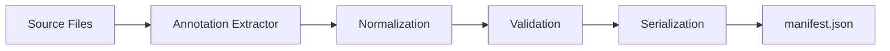

# Manifest Generation Model

Semantic Manifests are generated from AXAG annotations through extraction, normalization, and serialization.

## Generation Pipeline

## Generation Approaches

### Build-Time Extraction (Recommended)
A build plugin scans source files (HTML, JSX, TSX, Vue SFC) for `axag-*` attributes and generates the manifest during the build process.

### Runtime Extraction
A client-side script reads `axag-*` attributes from the live DOM. Useful for dynamic applications where annotations are computed at runtime.

### Static Analysis
An AST-based analyzer processes source files without rendering. Most reliable for CI/CD validation.

## Extraction Rules
1. Scan all elements with any `axag-*` attribute
2. Group attributes by element
3. Resolve context inheritance from parent elements
4. Normalize parameter references
5. Validate required fields per conformance level
6. Serialize to manifest JSON
