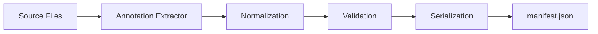

# Manifest Generation Model

Semantic Manifests are generated from AXAG annotations through extraction, normalization, and serialization.

## Generation Pipeline

```mermaid
graph LR
    A[Source Files] --> B[Annotation Extractor]
    B --> C[Normalization]
    C --> D[Validation]
    D --> E[Serialization]
    E --> F[manifest.json]
```

## Generation Approaches

### Build-Time Extraction (Recommended)
A bundler plugin reads source files (HTML, JSX, TSX, Vue SFC, Angular templates) and generates the manifest during the build. See [Build-Time Compilation](/docs/tool-generation/build-time-compilation).

### Runtime Extraction
A client-side script reads `axag-*` attributes from the live DOM. Useful for dynamic applications where annotations are computed at runtime.

### Static Analysis
An AST-based analyzer processes source files without rendering — `axag generate` in CI, using the same compiler as the bundler plugin. Most reliable for CI/CD validation.

Annotations whose value is only known at runtime (`axag={spec}` built from props) can't be extracted statically. Generators list them under `dynamic_actions` so a runtime knows the manifest is incomplete for that page.

## Extraction Rules
1. Scan all elements with any `axag-*` attribute
2. Group attributes by element
3. Resolve context inheritance from parent elements
4. Normalize parameter references
5. Validate required fields per conformance level
6. Serialize to manifest JSON
