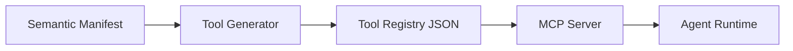

# Tool Registry Generation

The Tool Registry is a collection of all MCP tool definitions generated from the Semantic Manifest.

## Registry Structure
```json title="Tool registry structure"
{
  "registry_version": "0.1.0",
  "generated_at": "2026-03-14T10:00:00Z",
  "source_manifest": "ecommerce-app",
  "tools": [
    { "tool_name": "product_search", "..." : "..." },
    { "tool_name": "cart_add_item", "..." : "..." },
    { "tool_name": "begin_checkout", "..." : "..." }
  ]
}
```

## Generation Pipeline


## Serving the Registry
- Static JSON file served at a well-known endpoint
- MCP server that dynamically resolves tools from the manifest
- API endpoint that returns tool definitions on demand
