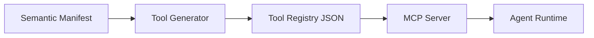

# Tool Registry Generation

The Tool Registry is a collection of all MCP tool definitions generated from the Semantic Manifest.

## Registry Structure
```json title="Tool registry structure"
{
  "schema_version": "1.0.0",
  "generated_at": "2026-03-14T10:00:00.000Z",
  "source_manifest": "axag-manifest.json",
  "tools": [
    { "name": "product_search", "description": "…", "input_schema": {}, "metadata": {} },
    { "name": "cart_add_item", "description": "…", "input_schema": {}, "metadata": {} },
    { "name": "checkout_begin", "description": "…", "input_schema": {}, "metadata": {} }
  ]
}
```

## Generation Pipeline

```mermaid
graph LR
    A[Semantic Manifest] --> B[Tool Generator]
    B --> C[Tool Registry JSON]
    C --> D[MCP Server]
    D --> E[Agent Runtime]
```

## Serving the Registry
- Static JSON file served at a well-known endpoint
- MCP server that dynamically resolves tools from the manifest
- API endpoint that returns tool definitions on demand
