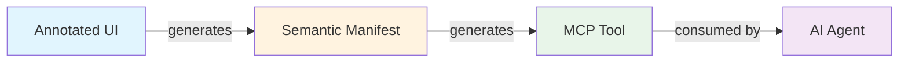

# Cross-Domain Comparison

This page provides a comprehensive comparison of AXAG patterns across all domains, highlighting how the same core annotation model adapts to different business contexts.

## Risk Level Distribution by Domain

| Domain | None | Low | Medium | High | Critical |
|--------|------|-----|--------|------|----------|
| E-Commerce | Search, Track | Add to Cart | Checkout | Returns | — |
| Marketing | Segmentation | Campaign Create | — | Scheduling | — |
| CRM | Forecasting | Lead Create | Opportunity | — | — |
| Travel | Search | — | — | Cancellation | Booking |
| Jobs | Job Search | — | Application, Interview | — | — |
| Analytics | Dashboard, Export | Report Gen | — | — | — |
| Support | — | Ticket Create | Escalation | — | — |
| Enterprise | List Users | — | Submit Approval | Approve/Reject, Settings | Billing, MFA |

## Confirmation Requirements by Risk Level

| Risk Level | Confirmation Required? | Example |
|------------|----------------------|---------|
| `none` | No | Product search, dashboard filtering |
| `low` | No | Add to cart, create lead, create ticket |
| `medium` | Yes (recommended) | Begin checkout, submit application |
| `high` | **Yes (MUST)** | Returns, escalation, approve/reject |
| `critical` | **Yes (MUST)** + Approval | Travel booking, billing change, disable MFA |

## Idempotency Patterns

### Idempotent Operations (Safe to Retry)
- All `read` operations (search, list, track, filter, forecast)
- State transitions to same state (advance to same stage, approve already-approved)
- Schedule updates (re-scheduling to same time)
- Soft deletes (deleting already-deleted records)

### Non-Idempotent Operations (Dangerous to Retry)
- `create` operations (leads, tickets, campaigns, applications)
- Add to cart (doubles quantity)
- Report/export generation (creates duplicate jobs)
- Escalation (creates duplicate events)

## Common Annotation Attributes by Operation Type

### Read Operations
```
axag-action-type="read"
axag-risk-level="none"
axag-idempotent="true"
```

### Create Operations
```
axag-action-type="write"
axag-risk-level="low"
axag-idempotent="false"
```

### Update/State-Change Operations
```
axag-action-type="write"
axag-risk-level="medium" | "high"
axag-idempotent="true"
axag-confirmation-required="true" (if medium+)
```

### Delete/Destructive Operations
```
axag-action-type="delete"
axag-risk-level="high"
axag-confirmation-required="true"
axag-idempotent="true" (if soft delete)
```

### Financial/Critical Operations
```
axag-action-type="write"
axag-risk-level="critical"
axag-confirmation-required="true"
axag-approval-required="true"
axag-approval-roles='[...]'
```

## Scraping Failure Patterns

Every domain exhibits the same fundamental scraping failures:

| Failure Category | Examples |
|-----------------|----------|
| **Visual-only data** | Charts (Canvas/SVG), status icons, color-coded badges |
| **Dynamic components** | Date pickers, query builders, drag-and-drop, WYSIWYG editors |
| **Session/state dependency** | Cart state, auth tokens, tenant context, checkout sessions |
| **Anti-bot protection** | CAPTCHAs, rate limiting, fingerprinting, IP blocking |
| **External systems** | Payment iframes, calendar invites, carrier tracking, email delivery |
| **Build-tool obfuscation** | Hashed CSS classes, minified markup, tree-shaken components |

## AXAG Resolution Pattern

Across all domains, AXAG resolves these failures with the same three-layer approach:



1. **Annotation Layer**: `axag-*` attributes on HTML elements declare intent, parameters, constraints, and safety metadata
2. **Manifest Layer**: Machine-readable JSON manifest aggregates all annotations into a discoverable contract
3. **Tool Layer**: Generated MCP tools provide type-safe, constraint-aware callable interfaces for agents

This three-layer approach is **domain-agnostic** — the same annotation vocabulary works for e-commerce, CRM, analytics, and enterprise alike.
