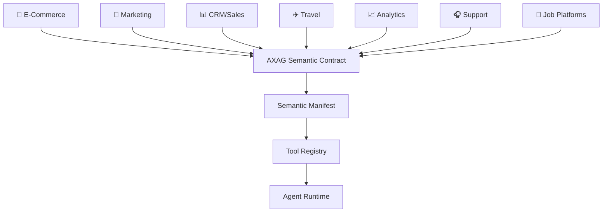

# Use Cases Overview

AXAG is domain-agnostic. This section demonstrates how AXAG applies across industries where automated interaction and scraping are currently common.

## Cross-Domain Architecture

Each domain exposes its operations through the same semantic contract format. Agents interact with semantic operations rather than scraping domain-specific interface structures.

## Domain Coverage

| Domain | Key Operations | Common Scraping Target |
|--------|---------------|----------------------|
| **E-Commerce** | Search, cart, checkout, tracking, returns | Product cards, price elements, cart widgets |
| **Marketing** | Campaigns, audiences, experiments, scheduling | Dashboard layouts, form wizards |
| **Sales/CRM** | Leads, opportunities, pipeline, forecasting | Data tables, stage dropdowns |
| **Travel** | Flights, hotels, booking, cancellation | Search results, availability grids |
| **Jobs** | Search, applications, interviews | Job listings, application forms |
| **Analytics** | Reports, dashboards, exports | Chart data, filter panels |
| **Support** | Tickets, escalation, knowledge base | Ticket queues, status dropdowns |
| **Enterprise SaaS** | CRUD, admin, tenant operations | Settings panels, user management |

## Cross-Domain Scraping Replacement Comparison

| Domain | Current Scraping Method | Common Failure Mode | AXAG Semantic Intent | Generated Tool |
|--------|------------------------|--------------------|--------------------|---------------|
| E-Commerce | Parse product card DOM | CSS class churn | `product.search` | `product_search` |
| Marketing | Scrape campaign dashboard | Dynamic rendering | `campaign.create` | `campaign_create` |
| CRM | Extract pipeline table | Layout restructuring | `opportunity.update_stage` | `opportunity_update_stage` |
| Travel | Parse search results grid | Anti-bot defenses | `flight.search` | `flight_search` |
| Jobs | Scrape job listing cards | Localization changes | `job.search` | `job_search` |
| Analytics | Extract chart data | Async loading | `report.generate` | `report_generate` |
| Support | Parse ticket queue | Modal complexity | `ticket.create` | `ticket_create` |

## Next Steps

Explore domain-specific use cases:
- [E-Commerce](/docs/use-cases/ecommerce/product-search)
- [Marketing](/docs/use-cases/marketing/campaign-creation)
- [Sales & CRM](/docs/use-cases/crm/lead-creation)
- [Travel & Booking](/docs/use-cases/travel/search-and-reservation)
- [Job Platforms](/docs/use-cases/jobs/job-search)
- [Analytics & BI](/docs/use-cases/analytics/dashboard-filtering)
- [Customer Support](/docs/use-cases/support/ticket-creation)
- [Enterprise & SaaS](/docs/use-cases/enterprise/crud-dashboard)
