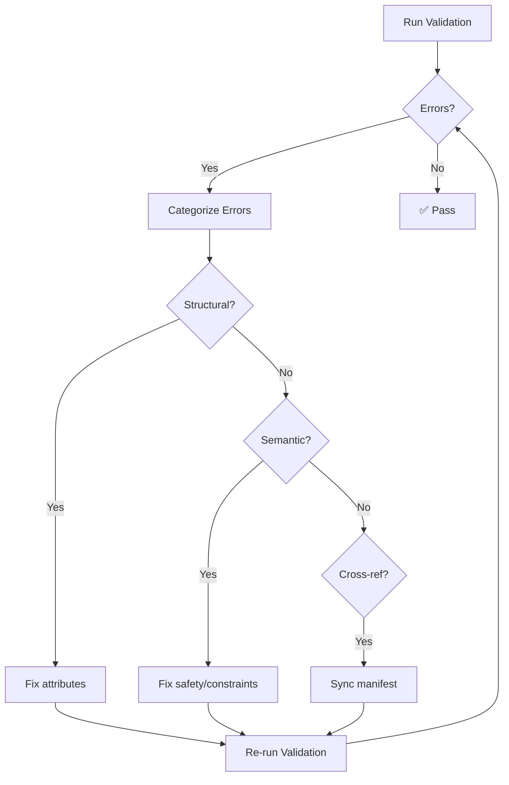

# Remediation Guidance

When AXAG validation produces errors or warnings, this page provides step-by-step guidance to fix common issues and bring your annotations into conformance.

## Remediation Workflow



## Step 1: Fix Structural Errors First

Structural errors prevent the validator from analyzing your annotations further. Fix these first:

1. **Add missing required attributes**: Every annotated element needs `axag-intent`, `axag-entity`, `axag-action-type`
2. **Fix JSON syntax**: Validate JSON strings in parameter attributes with a JSON linter
3. **Correct enum values**: Use only allowed values for `axag-action-type` (`read`, `write`, `delete`) and `axag-risk-level` (`none`, `low`, `medium`, `high`, `critical`)

## Step 2: Resolve Semantic Warnings

Once structural errors are cleared, address semantic issues:

### Risk/Confirmation Matrix
Ensure your risk levels and confirmation requirements align:

| Risk Level | `confirmation_required` | `approval_required` |
|------------|------------------------|---------------------|
| `none` | Not needed | Not needed |
| `low` | Not needed | Not needed |
| `medium` | Recommended | Not needed |
| `high` | **MUST** | Recommended |
| `critical` | **MUST** | **MUST** |

### Idempotency Checklist
For each write/delete operation, determine idempotency:
- **Idempotent** if calling it twice with the same parameters produces the same result (e.g., set status, update fields, soft delete)
- **Not idempotent** if calling it twice creates duplicate effects (e.g., create record, add to cart, send notification)

### Scope Checklist
For operations that access data, declare the scope:
- `public` — No authentication required
- `user` — Scoped to the authenticated user
- `tenant` — Scoped to the user's organization
- `global` — Affects all tenants (rare, admin-only)

## Step 3: Synchronize Manifest

After fixing annotations, ensure the Semantic Manifest is in sync:

```bash title="Regenerate manifest after fixes"
# Regenerate manifest from annotations
npx axag-generate-manifest --input src/ --output axag-manifest.json

# Or manually add missing intents to existing manifest
# Edit axag-manifest.json and add the missing action definitions
```

## Step 4: Auto-Fix Where Possible

Some validators support auto-fixing:

```bash
# Auto-fix common issues
npx axag-lint src/ --fix

# What auto-fix handles:
# - Add missing axag-idempotent="false" to write actions
# - Add axag-confirmation-required="true" to high/critical risk
# - Fix JSON attribute formatting
# - Normalize intent naming to snake_case
```

## Step 5: Verify with Conformance Check

After remediation, verify your target conformance level:

```bash
# Check target level
npx axag-conformance --manifest axag-manifest.json --level intermediate --verbose

# Verbose output shows:
# ✓ 45/45 actions have intent declared
# ✓ 45/45 actions have parameters with types
# ✓ 42/45 actions have risk level declared
# ✗ 3 actions missing risk level (list below)
#   - admin.view_logs
#   - config.list_options
#   - help.search
```

## Incremental Adoption

You don't have to fix everything at once. Start with:

1. **Week 1**: Fix all structural errors (Level 1 / Basic)
2. **Week 2**: Add parameter types and risk levels (Level 2 / Intermediate)
3. **Week 3**: Add preconditions, postconditions, and safety metadata (Level 3 / Full)

Set up CI to enforce the current target level and increase it as your team progresses.
